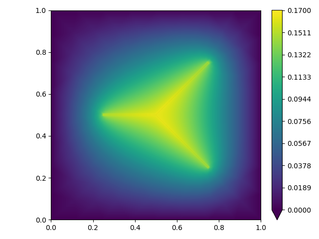

[](https://github.com/samuelburbulla/dune-mmesh/releases)
[](https://github.com/samuelburbulla/dune-mmesh/actions/)
[](https://doi.org/10.21105/joss.03959)
[](https://www.gnu.org/licenses/gpl-3.0)

# The Dune-MMesh Module

In several physical and environmental processes that concern multiphase flows, biological systems, and geophysical phenomena, important physical processes occur along thin physical interfaces. These processes include effects that may alter the interface's position or topology over time creating a moving interface, which complicates traditional modeling techniques. Moving interface problems thus require advanced numerical tools with specific treatment of the interface and the simultaneous ability to implement complex physical effects.

Dune-MMesh is tailored for numerical applications with moving physical interfaces. It is an implementation of the well-developed [Dune](https://www.dune-project.org) grid interface and is well-suited for the numerical discretization of partial differential equations. The package wraps two and three dimensional [CGAL](https://www.cgal.org) triangulations in high-level objects like intersections of grid entities, index and id sets and geometry transformations and exports a predefined set of facets as a separate interface grid.
In two dimensions, the arbitrary movement of vertices is enhanced with a re-meshing algorithm that implements non-hierarchical adaptation procedures. Besides the adaptation of the triangulation, Dune-MMesh provides the necessary data structures to adapt discrete functions defined on the bulk grid or the interface. This adaptation approach complements existing grid implementations within the Dune framework that strictly rely on hierarchical adaptation.
Various examples in Python have been implemented based on the discretization module [dune-fem](https://www.dune-project.org/sphinx/dune-fem/) that demonstrate the versatile applicability of Dune-MMesh. Due to the ability to handle custom PDEs in their weak from written in Unified Form Language (UFL) and the mesh adaptation capabilities, we believe Dune-MMesh provides a useful tool for solving mixed-dimensional PDEs on moving interfaces that arise from various fields of modelling.

You find the full documentation of Dune-MMesh at [dune-mmesh.readthedocs.io](https://dune-mmesh.readthedocs.io).

## Installation

Note that Dune-MMesh has a list of dependencies: C++ compiler, CMake, Python3 + pip (+ venv), pkg-config, Boost, OpenMPI, SuiteSparse, Gmsh.

The easiest starting point is to use Docker with a preconfigured setup.
Using the pre-built Docker container you can simply run:

````
docker run -it ghcr.io/samuelburbulla/dune-mmesh:master
````

This will open an interactive shell in the Dune-MMesh's examples directory.

__On your system__

In order to install and use Dune-MMesh on your system you have to install the requirements.

On Linux the requirements could be installed as follows:
````
apt install g++ cmake python3 python3-pip python3-venv git
apt install pkg-config libboost-dev libopenmpi-dev openmpi-bin libsuitesparse-dev gmsh git-lfs
````

On MacOS, you can install the required dependencies with Xcode Command Line Tools and Homebrew:
````
xcode-select --install
brew install pkg-config boost openmpi suite-sparse gmsh git-lfs
````

We strongly recommend using a virtual environment:
````
python3 -m venv dune-env
source dune-env/bin/activate
````

Install the Dune-MMesh package using pip:
````
pip install dune-mmesh
````
Note that this takes some time in order to compile all dependent Dune modules.

Now, you should be able to execute Dune-MMesh's python code. For instance:
````
git clone https://github.com/samuelburbulla/dune-mmesh.git
cd dune-mmesh/doc/examples
python coupling.py
````

Further details on the installation procedure can be found on [Installation](https://dune-mmesh.readthedocs.io/en/latest/installation.html).


## Example

You can find a collection of examples of how to use Dune-MMesh on our [Examples](https://dune-mmesh.readthedocs.io/en/latest/examples.html) page.


In a short example below we show how to use Dune-MMesh in general.
We use `.msh` files generated by gmsh to define the geometry of our mesh.
````
import gmsh
gmsh.initialize()
gmsh.option.setNumber("Mesh.MshFileVersion", 2.2)
name = "grid.msh"
h = 0.01
gmsh.model.add(name)
kernel = gmsh.model.occ
box = kernel.addRectangle(0, 0, 0, 1, 1)
p0 = kernel.addPoint(0.5, 0.5, 0, h)
p1 = kernel.addPoint(0.25, 0.25, 0, h)
p2 = kernel.addPoint(0.75, 0.75, 0, h)
p3 = kernel.addPoint(0.75, 0.25, 0, h)
lf1 = kernel.addLine(p0, p1)
lf2 = kernel.addLine(p0, p2)
lf3 = kernel.addLine(p0, p3)
kernel.synchronize()
gmsh.model.mesh.embed(1, [lf1, lf2, lf3], 2, box)
gmsh.model.mesh.generate(dim=2)
gmsh.write(name)
gmsh.finalize()
````

Read the generated `.msh` file and construct bulk and interface triangulation.
````
from dune.grid import reader
from dune.mmesh import mmesh
gridView  = mmesh((reader.gmsh, name), 2)
igridView = gridView.hierarchicalGrid.interfaceGrid
````

Now, we can solve a mixed-dimensional PDE.
````
from dune.mmesh import trace, skeleton, interfaceIndicator, monolithicSolve

from dune.fem.space import dglagrange, lagrange
space = dglagrange(gridView, order=3)
ispace = lagrange(igridView, order=3)

from ufl import *
u = TrialFunction(space)
v = TestFunction(space)
n = FacetNormal(space)
h = MinFacetEdgeLength(space)
uh = space.interpolate(0, name="uh")

iu = TrialFunction(ispace)
iv = TestFunction(ispace)
iuh = ispace.interpolate(0, name="iuh")

from dune.mmesh import interfaceIndicator
I = interfaceIndicator(igridView)

from dune.ufl import Constant
q = Constant(1, name="q")
beta = Constant(1e2, name="beta")
omega = Constant(1e-6, name="omega")

a  = inner(grad(u), grad(v)) * dx
a += beta / h * inner(jump(u), jump(v)) * (1-I)*dS
a -= dot(dot(avg(grad(u)), n('+')), jump(v)) * (1-I)*dS

a += beta / h * inner(u - 0, v) * ds
a -= dot(dot(grad(u), n), v) * ds

ia  = inner(grad(iu), grad(iv)) * dx
ib  = q * iv * dx

from dune.mmesh import skeleton, trace
a -= (skeleton(iuh)('+') - u('+')) / omega * v('+') * I*dS
a -= (skeleton(iuh)('-') - u('-')) / omega * v('-') * I*dS

ia += (iu - trace(uh)('+')) / omega * iv * dx
ia += (iu - trace(uh)('-')) / omega * iv * dx

from dune.fem.scheme import galerkin
scheme = galerkin([a == 0])
ischeme = galerkin([ia == ib])

from dune.mmesh import monolithicSolve
monolithicSolve(schemes=(scheme, ischeme), targets=(uh, iuh), verbose=True)
````

We can write the solution to `.vtk` or plot with matplotlib.
````
gridView.writeVTK("example", pointdata=[uh], nonconforming=True)
igridView.writeVTK("interface", pointdata=[iuh])

import matplotlib.pyplot as plt
from dune.fem.plotting import plotPointData as plot
fig = plt.figure()
plot(uh, linewidth=0, clim=[0, 0.17], figure=fig)
plot(iuh, linewidth=0.01, colorbar=None, clim=[0, 0.17], figure=fig)
plt.savefig("plot.png")
````



## Testing
You can test your installation of Dune-MMesh by running the python tests
````
python -m dune.mmesh test
````
Further tests of the C++ backend can be performed with a [source build](https://dune-mmesh.readthedocs.io/en/latest/installation.html#from-source) executing `make build_test` and `make test` in the build directory.

## Contribution

Contributions are highly welcome. If you want to contribute, please use our [GitLab](https://gitlab.dune-project.org/samuel.burbulla/dune-mmesh)
or [GitHub](https://github.com/samuelburbulla/dune-mmesh/) to report an issue or open a merge/pull request.

## License
Dune-MMesh is licensed under the terms and conditions of the GNU General Public License (GPL) version 3 or - at your option - any later version.
