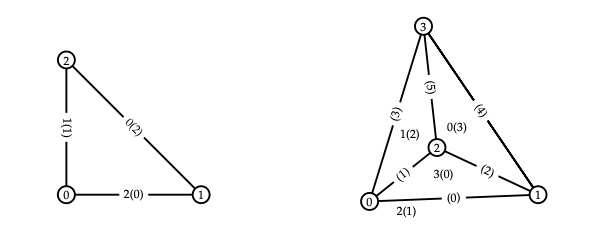
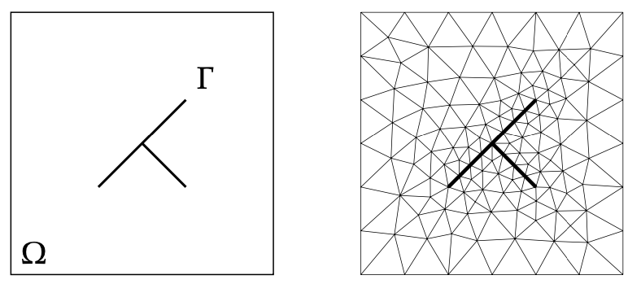
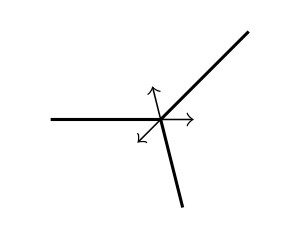
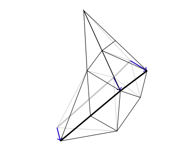
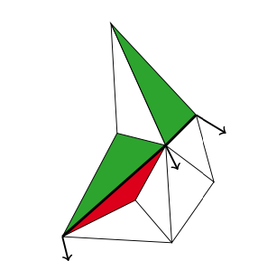
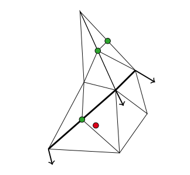
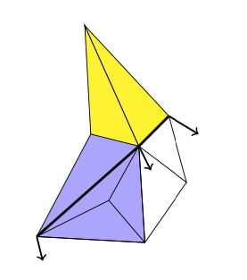
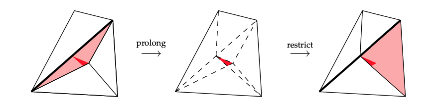
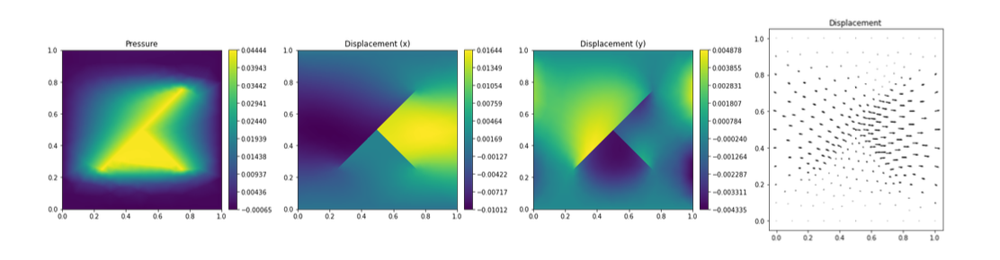

# Summary

Dune-MMesh is an implementation of the DUNE [@BBD+21] grid interface that is tailored for numerical applications with possibly moving physical interfaces. The implementation based on CGAL triangulations [@CGAL] supports two and three dimensional meshes and can export a predefined set of facets as a separate interface grid. In spatial dimension two, arbitrary movement of vertices is enhanced with a remeshing algorithm that implements non-hierarchical adaptation procedures. We present a collection of examples based on the python bindings of the discretization module dune-fem [@DNK20] that demonstrate the versatile applicability of Dune-MMesh.

# Statement of need

In many technical applications, in particular in the field of fluid dynamics, comparably thin physical interfaces can have a large impact on the overall behaviour of a modeled system. For instance, interfaces occur as separating layer between fluid phases in multiphase flows, in fluid- structure interaction and fluid-solid phase change. Even fractures in porous media can be modeled by lower-dimensional surfaces. Oftentimes, these interfaces move over time and the processes become free-boundary value problems.

The grid implementation Dune-MMesh aims at providing numerical capabilities for grid based methods to model interface-driven processes within the DUNE framework. Essentially, it consists of two things: A triangulation based on CGAL where a set of facets is considered as interface and the possibility to re-mesh the triangulation when necessary.
These two ingredients enable many new possibilities within the DUNE framework.
The representation of some grid facets as an interface makes Dune-MMesh a useful tool for the implementation of mixed-dimensional models.
The inevitable non-hierarchical adaptation complements the existing grid implementations within the DUNE framework and allows for unprecedent flexibility of grid adaptation.

# CGAL Wrapper

In its core, Dune-MMesh is a wrapper of CGAL Triangulations in $\mathbb{R}^d, d = 2, 3,$ that implements the Dune grid interface.

A CGAL triangulation is a set of simplicial cells and vertices.
Each cell gives access to its $d+1$ incident vertices and its $d+1$ adjacent cells.
Each vertex gives access to one of its incident cells.
The $d+1$ vertices are indexed with $0, 1, \dots, d$ in positive orientation being defined by the orientation of
the underlying Euclidian space $\mathbb{R}^d$.
The neighbors of a cell are also indexed with $0, 1, \dots, d$ in such a way
that the neighbor is opposite to the vertex with the same index.
Facets are not explicitly represented: a facet is given by the pair of a cell $c$
and an index $i$. Here, the facet $i$ of cell $c$ is the facet of $c$ that is
opposite to the vertex with index $i$. Remark that a facet has two implicit representations.
For $d=3$, edges are represented by triples of a cell $c$ and
two indices $i$ and $j$ that indicate the two vertices of the edge.

In order to match the Dune grid interface we have to follow the reference element numbering, cf. Figure \ref{fig:wrapper}.
Fortunately, the vertex numbering of cells can be retained, buy each facet $i$ of the CGAL representation corresponds to the codim-1 subentity $d-i$ in the Dune reference element.
For the representation of Dune intersections we can directly use CGAL's cell-index representation of facets
which is already equipped with an orientation.
Various iterators of CGAL triangulations can directly be used to construct the Dune grid range generators.
Additional (non-standard Dune) iterators have been added, e.g. iterating over the incident elements of a vertex.

# Interface Grid

Consider a domain $\Omega \subset \mathbb{R}^d, d \in \{2,3\},$ that includes a
$(d-1)$-dimensional interface $\Gamma \subset \Omega$, as depicted in Figure \ref{fig:triangulation}.
We assume the domain is triangulated conforming to the interface $\Gamma$.

Let us denote this triangulation by $\mathcal{T}$ and the set of facets by $\mathcal{F}$.
Due to conforming meshing, there exists a subset of facets $\mathcal{F}_\Gamma \subset \mathcal{F}$
that belong to the interface $\Gamma$.
Therefore, these facets in $\mathcal{F}_\Gamma$ can also be interpreted as a triangulation of a surface.
We call this surface triangulation the \emph{interface grid} and denote it by $\mathcal{T}_\Gamma$.

Dune-MMesh features a second implementation of the Dune grid interface that represents the interface triangulation $\mathcal{T}_\Gamma$.
Therefore, facets have to be marked as belonging to the interface - usually this is done when parsing a .msh file.

The interface grid can be used like any other Dune grid as it implements all necessary functionality.

A codim-0 entity of the interface grid is represented by a CGAL cell-index pair as used for the codim-1 entities of the wrapper implementation.
This representation is made unique by taking the representation where the cell has the lower index - which is also considered to be the positive side of the facet.

The interface grid also supports networks. For this purpose, the intersection iterator returns all common intersections with
adjacent cells, cf. Figure \ref{fig:junction}.

{ width=30% }

Each bulk grid intersection can be identified belonging to the interface or not.
It is also possible to convert bulk intersections to interface grid elements and vice versa as the underlying representation is the same.

# Moving Mesh

Most interface driven-problems have time-dependent interfaces $\Gamma = \Gamma(t)$.
Therefore, Dune-MMesh features capabilities of moving and remeshing in spatial dimension two.

### Moving Vertices

Dune-MMesh allows the movement of interface vertices (or all grid vertices) by a predescribed movement.

For this, we assume that movement is given by the shift of vertices.
This movement can be performed by simply changing the coordinates of the vertices.

{ width=30% }
{ width=30% }

Remark that moving vertices might lead to degeneration of the triangulation, i.e. cells can have non-positive volume.
To prevent that, Dune-MMesh is equipped with remeshing routines we describe in the following.

### Adaptation

Adaption in DUNE is usually hierarchical by definition and the adaptation procedure is performed in two stages:

1. Mark: Grid elements are marked for coarsening or refinement.
2. Adapt: The elements are adapted due to their markers and discrete functions are restricted or prolongated.

In Dune-MMesh, due to the moving mesh, non-hierarchic adaptation is inavoidable.
However, we will try to follow the general DUNE approach and separate the adaptation into two stages.

__1. Mark__

Dune-MMesh provides some utility functions to mark cells either in expectation of a movement of vertices or regarding their current geometrical properties. However, one can also use a proprietary procedure marking elements manually, or one can insert and remove vertices directly.

__2. Adapt__

After marking elements the `adapt` routine performs the actual adaptation process.
The adaptation is performed by insertion and removal of points.

{ width=30% }
{ width=30% }

In each element that is marked for refinement the refinement is done via bisection of the longest edge, cf. Figure \ref{fig:adapt}.
In all elements marked for coarsening, one vertex is removed.
Here, the vertex incident to the shortest edges of the cell is chosen, but we give priority on non-interface and non-boundary vertices.

When a vertex is removed, the resulting star-shaped hole is re-triangulated with respect to the interface.
For the purpose of projection, we introduce \emph{connected components}, see Figure \ref{fig:conncomp}.

A conservative projection of discrete functions can be performed by computing a cut-set triangulation
which enables evaluation with agglomerated quadrature rules on triangles.
Here, we prolong from an old cell onto such a cut triangle and prolong onto the new cell, cf. Figure \ref{fig:projection}.
This whole projection is performed under the hood and just assumes that you use the callback adaptation in dune-fem.
We use a similar concept on the interface grid that enables projection of discrete functions on the interface.

# Trace and skeleton

Dune-MMesh exports both traces of bulk discrete functions on the interface and skeleton representations of interface discrete functions on bulk edges.

The trace is a discrete function on the interface grid that evaluates a given bulk discrete function.
It can be restricted to positive ('+') or negative side ('-') and it might be used in UFL forms.

Analogously, the skeleton function is a discrete function that returns the interface's discrete function values on interface bulk facets.

Both `trace` and `skeleton` can be used to couple bulk and interface problems.

# Coupled solve

We provide two helper functions to solve bulk and interface schemes in a coupled way. Remark that for both methods the target discrete functions must be used in the coupling forms.

The first method `iterativeSolve` uses an iterative solution strategy with a vector formulation of Aitken's fix point acceleration. The method
alternately solves both passed schemes until the residuum (measured in two norm between two iterates) is below an objective tolerance.

The second helper function `monolithicSolve` solves a bulk and interface scheme coupled monolithically.
A newton method is implemented assembling the underlying jacobian matrix where the coupling jacobian blocks are evaluated by finite differences.

# Examples

We implemented a few examples to display how Dune-MMesh can be used in different contexts.
All examples can be found in [`dune-mmesh/doc/examples`](https://gitlab.dune-project.org/samuel.burbulla/dune-mmesh/-/tree/master/doc/examples) as IPython notebooks.
Some numerical results of these examples are visualized in Figure \ref{fig:fvmm}, Figure \ref{fig:poro} and Figure \ref{fig:navierstokes}.

![Finite volume moving mesh method to track a discontinuity [@CMR+18]\label{fig:fvmm}](img/fvmm.png)

![Two-phase Navier-Stokes equation [@GBK20].\label{fig:navierstokes}](img/navierstokes.png)

# Acknowledgements

Funded by the Deutsche Forschungsgemeinschaft (DFG, German Research Foundation) - Project Number 327154368 - SFB 1313.

We thank all contributors that improved Dune-MMesh via the GitLab repository, especially Timo Koch.

# References
